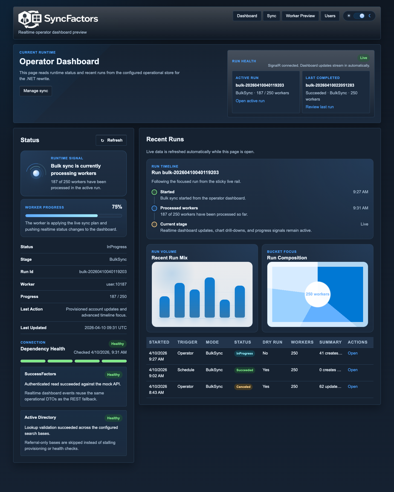

# [Alpha] SyncFactors

<p>
  
</p>

`SyncFactors` is the current .NET-based SyncFactors implementation and repository root.

> [!WARNING]
> [Alpha] This software is in active development, has a high risk of failure, and is not ready for production use.
> Expect breaking changes, incomplete workflows, missing features, and operational defects. Validate everything in a non-production environment first.

## Current State

- The active implementation is a local-first .NET 10 solution built around ASP.NET Core, a background worker, and SQLite-backed runtime state.
- The repository already contains operator-facing UI flows, run history, scheduling, dependency health probes, worker preview/apply flows, and authentication modes for local break-glass or OIDC-backed deployments.
- Production readiness is not implied by the current feature set, repository layout, sample config, or helper scripts.

Current dashboard snapshot:



## Goals

- Keep the product local-first and operator-friendly.
- Preserve dry-run, review, approvals, rollback, and auditability as first-class capabilities.
- Replace shell-driven orchestration with typed domain services and explicit job/state models where practical.
- Maintain a path from a single-tenant Windows admin tool to a future hosted control plane if that becomes necessary.

## Current Stack

- Runtime: .NET 10
- Operator UI: ASP.NET Core Razor Pages plus a bundled browser layer for realtime updates and analytics
- Frontend tooling: npm plus esbuild
- Frontend runtime packages: SignalR, Motion, and ECharts
- Background execution: .NET hosted worker service
- Runtime state: SQLite
- Directory integration: .NET plus PowerShell seams where needed
- Tests: xUnit across API, domain, infrastructure, and mock SuccessFactors projects

## Solution Shape

- `src/SyncFactors.Api`: local operator UI plus authenticated JSON endpoints for status, dashboard, health, runs, schedule management, and a realtime SignalR dashboard hub
- `src/SyncFactors.Worker`: background host that claims queued runs, executes sync work, records heartbeats, and processes recurring schedules
- `src/SyncFactors.MockSuccessFactors`: local SuccessFactors-like API plus fixture generation tooling for development and testing
- `src/SyncFactors.Domain`: run orchestration, preview/apply behavior, lifecycle rules, scheduling, and sync coordination
- `src/SyncFactors.Infrastructure`: SQLite persistence, Active Directory access, SuccessFactors client logic, authentication and local user storage, filesystem helpers, and config loading
- `src/SyncFactors.Contracts`: shared runtime DTOs and status models
- `tests/*`: unit and integration test projects aligned to the runtime components above
- `config/*`: tracked sample config, mock fixture data, and scaffold data
- `docs/architecture.md`: architecture direction and system boundaries
- `docs/empjob-ad-mapping.md`: current field mapping notes for the `EmpJob` flow

## What Works Today

- Operator dashboard with current runtime status, recent runs, active run summary, dependency health, and realtime updates over SignalR
- Live dashboard visuals including run mix and bucket composition charts, a sticky live status rail, and a run timeline card
- Ad hoc run queueing for dry-run and live syncs
- Recurring full-sync schedule configuration backed by SQLite
- Run history and run detail pages
- Worker preview flow that stages one worker, persists the preview, and supports explicit apply from the saved fingerprint
- Authentication modes for local break-glass, OIDC-only, or hybrid SSO plus break-glass access, with local user management when break-glass is enabled
- Mock SuccessFactors API for local development, fixture playback, and synthetic worker population
- Delete-all testing reset flow from the Sync page
- Active Directory health checks that validate lookup behavior across configured search bases instead of only doing a bind/base-object probe
- Due graveyard retention report processing from the worker when alerts are configured

> [!CAUTION]
> The delete-all/testing reset flow is destructive. It exists for controlled testing and operator workflows and should be treated as dangerous even in non-production environments.

## Status

The solution builds from the repository root against the locally installed .NET 10 SDK.

The repository is still alpha. The implementation is concrete enough to document current operator flows, but APIs, config shape, storage details, and operational behavior may still change materially.

## Local Development

Primary commands from the repository root:

```powershell
dotnet build ./SyncFactors.Next.sln
dotnet test ./SyncFactors.Next.sln
```

The API UI now has a small frontend bundle under `src/SyncFactors.Api`. Install the frontend dependencies once per checkout:

```powershell
cd ./src/SyncFactors.Api
npm install
```

Build the browser bundle manually when needed:

```powershell
npm run build:ui
```

Or keep it rebuilding while you edit:

```powershell
npm run watch:ui
```

The helper scripts under `scripts/` and `scripts/codex/` are the current supported launch path for the local stack.

## Config Model

The current runtime keeps tracked samples and ignored local config under `config/`.

- `config/sample.mock-successfactors.real-ad.sync-config.json`: sample config for mock SuccessFactors plus real Active Directory
- `config/sample.real-successfactors.real-ad.sync-config.json`: sample config for real SuccessFactors plus real Active Directory
- `config/sample.empjob-confirmed.mapping-config.json`: sample mapping config for the current `EmpJob`-driven flow
- `config/local*.json`: local editable copies created by the worktree bootstrap script when missing

Sync config resolution currently works like this:

1. `.env.worktree` sets `SYNCFACTORS_RUN_PROFILE` to `mock` or `real`
2. If `SYNCFACTORS_CONFIG_PATH` is set, that explicit path wins
3. Otherwise the active profile resolves to `config/local.mock-successfactors.real-ad.sync-config.json` or `config/local.real-successfactors.real-ad.sync-config.json`
4. Mapping config resolves from `SYNCFACTORS_MAPPING_CONFIG_PATH`, or defaults to `config/local.syncfactors.mapping-config.json`

`.env.worktree` is the main per-worktree environment contract. Keep auth, profile selection, ports, and local overrides there rather than in tracked JSON or tracked `.codex` files.

On Windows, `scripts/codex/Load-WorktreeEnv.ps1` checks the worktree-scoped Windows Credential Manager entry for each variable first, then falls back to `.env.worktree`, then `.env.worktree.example`, and finally built-in defaults where applicable.

The checked-in example plus the built-in `scripts/codex/Load-WorktreeEnv.ps1` defaults currently resolve to:

```bash
SYNCFACTORS_RUN_PROFILE=mock
SYNCFACTORS_CONFIG_PATH=
SYNCFACTORS_MAPPING_CONFIG_PATH=./config/local.syncfactors.mapping-config.json
SYNCFACTORS_SQLITE_PATH=state/runtime/syncfactors.db
SYNCFACTORS_API_BIND_HOST=127.0.0.1
SYNCFACTORS_API_PUBLIC_HOST=127.0.0.1
SYNCFACTORS_API_PORT=5087
NUGET_HTTP_CACHE_PATH=state/nuget/http-cache
SYNCFACTORS_TLS_CERT_PATH=
SYNCFACTORS_TLS_CERT_PASSWORD=
MOCK_SF_PORT=18080
MOCK_SF_SYNTHETIC_POPULATION_ENABLED=true
MOCK_SF_TARGET_WORKER_COUNT=1000
SYNCFACTORS_KEYCHAIN_SERVICE=syncfactors
SF_AD_SYNC_SF_USERNAME=
SF_AD_SYNC_SF_PASSWORD=
SF_AD_SYNC_SF_CLIENT_ID=mock-client-id
SF_AD_SYNC_SF_CLIENT_SECRET=mock-client-secret
SF_AD_SYNC_AD_SERVER=
SF_AD_SYNC_AD_USERNAME=
SF_AD_SYNC_AD_BIND_PASSWORD=
SF_AD_SYNC_AD_DEFAULT_PASSWORD=
```

`.env.worktree.example` also carries the Entra/OIDC keys as commented placeholders until you intentionally enable SSO for that worktree.

On macOS, you can keep sensitive `SF_AD_SYNC_*` values out of `.env.worktree` entirely and store them in the login Keychain instead. The launchers fall back to the Keychain service named by `SYNCFACTORS_KEYCHAIN_SERVICE` when those variables are blank in `.env.worktree`. To store one:

```bash
./scripts/codex/set-macos-keychain-secret.sh SF_AD_SYNC_AD_BIND_PASSWORD
```

To import the full worktree secret set in one pass:

```bash
./scripts/codex/save-worktree-env-to-macos-keychain.sh
```

To enter selected values interactively and verify each save succeeded:

```bash
./scripts/codex/save-worktree-env-to-macos-keychain.sh --interactive SF_AD_SYNC_AD_BIND_PASSWORD SF_AD_SYNC_AD_DEFAULT_PASSWORD
```

On Windows, you can import worktree values into Windows Credential Manager with:

```powershell
pwsh ./scripts/codex/Save-WorktreeEnvToWindowsCredentialManager.ps1
```

Before starting the API on a new admin workstation, run:

```powershell
pwsh ./scripts/Install-SyncFactorsHttpsCertificate.ps1
```

That script generates, trusts, and exports the local HTTPS certificate used by the API launcher. By default the launcher binds `https://127.0.0.1:<port>` and refuses `http://` URLs. If `SYNCFACTORS_TLS_CERT_PATH` and `SYNCFACTORS_TLS_CERT_PASSWORD` are not set explicitly, the launcher uses the exported certificate from that install step.

If you already have a CA-issued `.pfx`, use:

```powershell
pwsh ./scripts/Install-SyncFactorsHttpsCertificateFromPfx.ps1 -PfxPath C:\path\to\syncfactors-api.pfx -PfxPassword '<password>'
```

That script copies your PFX into the same runtime certificate location used by the launcher, writes the matching password file, and on Windows imports the certificate into the `My` store. Add `-StoreLocation LocalMachine` to target the machine store instead of the current user store, or `-SkipStoreImport` if you only want to configure the app runtime files.

For remote UI access from another machine, set these env values in `.env.worktree`:

```bash
SYNCFACTORS_API_BIND_HOST=0.0.0.0
SYNCFACTORS_API_PUBLIC_HOST=<dns-name-or-lan-ip>
SYNCFACTORS_API_PORT=5087
```

Keep `SYNCFACTORS_API_BIND_HOST` on the listener address and `SYNCFACTORS_API_PUBLIC_HOST` on the exact host users browse to. The public host must match the HTTPS certificate and the Entra redirect URIs. The dev certificate from `Install-SyncFactorsHttpsCertificate.ps1` is localhost-only, so remote access requires a PFX whose SAN covers `<dns-name-or-lan-ip>`.

Use `--remove-empty-values` on macOS or `-RemoveEmptyValues` on Windows if blank entries in `.env.worktree` should delete the corresponding stored credentials instead of saving empty strings.

Set `SYNCFACTORS_RUN_PROFILE=mock` or `real` to switch the active SuccessFactors config. Leave `SYNCFACTORS_CONFIG_PATH` empty for profile-based resolution, or set it only when you want an explicit one-off override.

To enable local rolling file logs for the SyncFactors API and worker, add these worktree env vars:

```bash
SYNCFACTORS_LOCAL_FILE_LOGGING_ENABLED=true
SYNCFACTORS_LOCAL_LOG_DIRECTORY=
```

When enabled, the API writes `api-*.log` and the worker writes `worker-*.log` with daily rotation and 7 retained files. Leave `SYNCFACTORS_LOCAL_LOG_DIRECTORY` blank to use the default runtime log directory under `%LocalAppData%/SyncFactors/logs` on Windows or `${XDG_DATA_HOME:-~/.local/share}/SyncFactors/logs` on macOS/Linux. This does not change preview artifact logs under `preview-logs`.

For Microsoft Entra ID OIDC in local development, add the ASP.NET config-bound environment variables below to `.env.worktree` once your app registration exists:

```bash
SYNCFACTORS__AUTH__MODE=oidc
SYNCFACTORS__AUTH__OIDC__AUTHORITY=https://login.microsoftonline.com/<tenant-id>/v2.0
SYNCFACTORS__AUTH__OIDC__CLIENTID=<application-client-id>
SYNCFACTORS__AUTH__OIDC__CLIENTSECRET=<client-secret>
SYNCFACTORS__AUTH__OIDC__VIEWERGROUPS__0=<entra-group-object-id>
SYNCFACTORS__AUTH__OIDC__OPERATORGROUPS__0=<entra-group-object-id>
SYNCFACTORS__AUTH__OIDC__ADMINGROUPS__0=<entra-group-object-id>
```

Use tenant-specific authorities, not `common`, so group and issuer checks stay deterministic for a single-tenant admin tool. Configure the Entra app registration with redirect URIs that match the public HTTPS host and port. For the default local setup:

```text
https://127.0.0.1:5087/signin-oidc
https://127.0.0.1:5087/signout-callback-oidc
```

If you change `SYNCFACTORS_API_PUBLIC_HOST` or `SYNCFACTORS_API_PORT`, the redirect URIs must match that exact HTTPS origin. On macOS, you can keep the OIDC secret out of `.env.worktree` and store only `SYNCFACTORS__AUTH__OIDC__CLIENTSECRET` in Keychain with `./scripts/codex/set-macos-keychain-secret.sh SYNCFACTORS__AUTH__OIDC__CLIENTSECRET`.

If you want the app registration provisioned for you, use [`scripts/Configure-EntraOidcAppRegistration.ps1`](scripts/Configure-EntraOidcAppRegistration.ps1). It connects to Microsoft Graph using your current/default tenant when `-TenantId` is omitted, creates or updates a single-tenant app registration, ensures the enterprise app exists, creates missing security groups for viewer/operator/admin roles, assigns those groups to the enterprise app, optionally creates a client secret, writes the resolved auth and OIDC settings back into `.env.worktree`, and then prints the same values in the terminal summary. Set `-AuthMode oidc` for Entra-only auth or `-AuthMode hybrid` to keep local break-glass enabled. Use `-ApiBindHost 0.0.0.0 -ApiPublicHost <dns-name-or-lan-ip>` when you are provisioning a remotely reachable UI. In `hybrid` mode the script also sets `SYNCFACTORS__AUTH__LOCALBREAKGLASS__ENABLED=true`, writes the bootstrap admin username, and generates a bootstrap admin password automatically if you do not supply one. On Windows it stores the OIDC client secret and bootstrap admin password in Windows Credential Manager; on macOS it stores those secrets in the login Keychain using `SYNCFACTORS_KEYCHAIN_SERVICE` from the env file when present, otherwise `syncfactors`. In those cases the env file keeps the password/secret entries blank so the repo loaders pull them from the secure store. Use `-EnvFilePath` if you want to target a different env file.

## Entra Env Setup

Use the provisioning script when you want the app registration and local auth env configured together. The script updates `.env.worktree` for you, so you should not need to hand-edit the OIDC values afterward unless you want to override something manually.

End-to-end flow:

1. Bootstrap the worktree if you have not already:

```powershell
pwsh ./scripts/codex/setup-worktree.ps1
```

2. Run the Entra provisioning script against your tenant. Pick one of the modes below.

OIDC only:

```powershell
pwsh ./scripts/Configure-EntraOidcAppRegistration.ps1 `
  -TenantId '<tenant-guid>' `
  -AppDisplayName 'SyncFactors Local Dev' `
  -ViewerGroupName 'SyncFactors Viewers' `
  -OperatorGroupName 'SyncFactors Operators' `
  -AdminGroupName 'SyncFactors Admins' `
  -ApiBindHost 0.0.0.0 `
  -ApiPublicHost '<dns-name-or-lan-ip>' `
  -AuthMode oidc `
  -RequireAssignment `
  -InstallModules
```

Hybrid OIDC plus local break-glass admin:

```powershell
pwsh ./scripts/Configure-EntraOidcAppRegistration.ps1 `
  -TenantId '<tenant-guid>' `
  -AppDisplayName 'SyncFactors Local Dev' `
  -ViewerGroupName 'SyncFactors Viewers' `
  -OperatorGroupName 'SyncFactors Operators' `
  -AdminGroupName 'SyncFactors Admins' `
  -ApiBindHost 0.0.0.0 `
  -ApiPublicHost '<dns-name-or-lan-ip>' `
  -AuthMode hybrid `
  -BootstrapAdminUsername 'admin' `
  -RequireAssignment `
  -InstallModules
```

If the Entra app already exists, target it directly instead of locating it by display name:

```powershell
pwsh ./scripts/Configure-EntraOidcAppRegistration.ps1 `
  -TenantId '<tenant-guid>' `
  -ClientId '<existing-app-client-id>' `
  -AppDisplayName 'SyncFactors Local Dev' `
  -ViewerGroupName 'SyncFactors Viewers' `
  -OperatorGroupName 'SyncFactors Operators' `
  -AdminGroupName 'SyncFactors Admins' `
  -AuthMode oidc `
  -RequireAssignment
```

3. Confirm the env file values. After a successful run, `.env.worktree` will contain or update these keys:

- `SYNCFACTORS__AUTH__MODE`
- `SYNCFACTORS__AUTH__LOCALBREAKGLASS__ENABLED`
- `SYNCFACTORS__AUTH__OIDC__AUTHORITY`
- `SYNCFACTORS__AUTH__OIDC__CLIENTID`
- `SYNCFACTORS__AUTH__OIDC__VIEWERGROUPS__0`
- `SYNCFACTORS__AUTH__OIDC__OPERATORGROUPS__0`
- `SYNCFACTORS__AUTH__OIDC__ADMINGROUPS__0`
- `SYNCFACTORS__AUTH__BOOTSTRAPADMIN__USERNAME` in `hybrid` mode

The script also manages these secrets:

- `SYNCFACTORS__AUTH__OIDC__CLIENTSECRET`
- `SYNCFACTORS__AUTH__BOOTSTRAPADMIN__PASSWORD` in `hybrid` mode

On Windows, those secrets are stored in Windows Credential Manager. On macOS, they are stored in the login Keychain. In those cases the `.env.worktree` entries are intentionally left blank and loaded at runtime by the repo launchers. On other platforms, the script writes the secret values directly into the env file.

4. Start the app:

```powershell
pwsh ./scripts/codex/run.ps1 -Service api
```

Or the full stack:

```powershell
pwsh ./scripts/codex/run.ps1 -Service stack
```

5. Open the login page:

- [https://127.0.0.1:5087/Login](https://127.0.0.1:5087/Login)
- Or browse to `https://<SYNCFACTORS_API_PUBLIC_HOST>:<SYNCFACTORS_API_PORT>/Login` when you configured remote access.

Mode behavior:

- `oidc`: Entra sign-in only. The script sets `SYNCFACTORS__AUTH__LOCALBREAKGLASS__ENABLED=false`.
- `hybrid`: Entra sign-in plus local break-glass auth. The script sets `SYNCFACTORS__AUTH__LOCALBREAKGLASS__ENABLED=true` and provisions the bootstrap admin credentials.

If startup fails because the app is still asking for bootstrap admin credentials while you expected Entra-only auth, check that `.env.worktree` contains `SYNCFACTORS__AUTH__MODE=oidc` and `SYNCFACTORS__AUTH__LOCALBREAKGLASS__ENABLED=false`.

If the app registration already exists, pass either `-ApplicationObjectId` or `-ClientId` and the script will reconcile that existing app to the desired state instead of locating one by display name.

Example:

```powershell
pwsh ./scripts/Configure-EntraOidcAppRegistration.ps1 `
  -AppDisplayName 'SyncFactors Local Dev' `
  -ViewerGroupName 'SyncFactors Viewers' `
  -OperatorGroupName 'SyncFactors Operators' `
  -AdminGroupName 'SyncFactors Admins' `
  -AuthMode oidc `
  -RequireAssignment `
  -InstallModules
```

Existing app example:

```powershell
pwsh ./scripts/Configure-EntraOidcAppRegistration.ps1 `
  -TenantId '<tenant-guid>' `
  -ClientId '<existing-app-client-id>' `
  -AppDisplayName 'SyncFactors Local Dev' `
  -ViewerGroupName 'SyncFactors Viewers' `
  -OperatorGroupName 'SyncFactors Operators' `
  -AdminGroupName 'SyncFactors Admins' `
  -RequireAssignment
```

Hybrid auth example with local break-glass bootstrap admin:

```powershell
pwsh ./scripts/Configure-EntraOidcAppRegistration.ps1 `
  -TenantId '<tenant-guid>' `
  -ClientId '<existing-app-client-id>' `
  -AppDisplayName 'SyncFactors Local Dev' `
  -ViewerGroupName 'SyncFactors Viewers' `
  -OperatorGroupName 'SyncFactors Operators' `
  -AdminGroupName 'SyncFactors Admins' `
  -AuthMode hybrid `
  -BootstrapAdminUsername 'admin' `
  -RequireAssignment
```

For Active Directory binds, the current .NET LDAP integration uses simple bind semantics. Set `SF_AD_SYNC_AD_USERNAME` to a UPN such as `svc_successfactors@example.local`, not a down-level logon name such as `EXAMPLE\svc_successfactors`, or AD may reject the credentials even when the password is correct.

If your primary AD transport is `ldaps` or `starttls` and you need an explicit downgrade path for troubleshooting, set `ad.transport.allowLdapFallback` to `true`. SyncFactors will try the configured secure transport first and only retry plain LDAP on port `389` when the configured port was the secure default. Leave this disabled unless you intentionally want that behavior.

For full-sync `EmpJob` queries, `successFactors.query.inactiveRetentionDays` can extend the source filter to keep recently inactive workers in scope without hand-writing the date cutoff in `baseFilter`. With the default fields, a config like `"baseFilter": "emplStatus in 'A','U'"` plus `"inactiveRetentionDays": 180` expands to include terminated (`emplStatus eq 'T'`) workers whose `endDate` is within the last 180 days. Override `inactiveStatusField`, `inactiveStatusValues`, or `inactiveDateField` if your tenant uses different fields or status codes.

## Authentication Modes

The API serves the same operator UI in all auth modes and protects it with cookie auth after sign-in.

- `local-break-glass`: the default appsettings mode. Local usernames and password hashes live in SQLite, and `/Admin/Users` manages those local accounts.
- `oidc`: enterprise OIDC sign-in only. The login page redirects or offers SSO, and local user management is disabled.
- `hybrid`: enterprise OIDC is the primary sign-in path, and local break-glass accounts remain available for emergency access.

On first startup, bootstrap admin credentials are only required when local break-glass auth is enabled and no local users exist yet. In `oidc` mode, the app skips that bootstrap requirement.

## Running The Local Stack

Bootstrap a checkout or worktree first:

```powershell
pwsh ./scripts/codex/setup-worktree.ps1
```

That script:

- creates runtime/report directories when missing
- creates `config/local.mock-successfactors.real-ad.sync-config.json` when missing
- creates `config/local.real-successfactors.real-ad.sync-config.json` when missing
- creates `config/local.syncfactors.mapping-config.json` when missing
- creates `.env.worktree` from `.env.worktree.example` when missing
- copies ignored local config from the primary worktree first when available

The intended local loop is:

```powershell
pwsh ./scripts/codex/setup-worktree.ps1
pwsh ./scripts/codex/run.ps1 -Service mock
pwsh ./scripts/codex/run.ps1 -Service api
pwsh ./scripts/codex/run.ps1 -Service worker
```

If you only want the operator portal, use:

```powershell
pwsh ./scripts/codex/run.ps1 -Service ui
```

There is no separate frontend dev server in the current design. The API serves the bundled UI, and the launcher builds that bundle automatically unless you pass `-SkipBuild`. `-Service ui` is effectively an alias for starting the API with the portal assets, and `-Service stack` brings up that same API as part of the stack.

If you are using Windows Credential Manager, import values before launching services:

```powershell
pwsh ./scripts/codex/Save-WorktreeEnvToWindowsCredentialManager.ps1
```

Or start the profile-aware stack in one command:

```powershell
pwsh ./scripts/codex/run.ps1 -Service stack
```

Useful variants:

- `pwsh ./scripts/codex/run.ps1 -Service stack -Profile mock`
- `pwsh ./scripts/codex/run.ps1 -Service stack -Profile real`
- `pwsh ./scripts/codex/run.ps1 -Service stack -Restart`
- `pwsh ./scripts/codex/run.ps1 -Service ui -Profile mock`
- `pwsh ./scripts/codex/run.ps1 -Service api -SkipBuild`

For remote UI access, set `SYNCFACTORS_API_BIND_HOST=0.0.0.0` and `SYNCFACTORS_API_PUBLIC_HOST=<dns-name-or-lan-ip>` before launching the API or stack, then browse to `https://<SYNCFACTORS_API_PUBLIC_HOST>:<SYNCFACTORS_API_PORT>/Login`.

When you run `-Service stack`, the launched services depend on the active profile:

- `mock`: starts the mock SuccessFactors API, the SyncFactors API, and the worker
- `real`: starts the SyncFactors API and the worker

Before `-Service stack` launches anything, the runner now does `git pull --ff-only` by default when the current branch has an upstream. Toggle that behavior in `config/local.codex-run.json`:

```json
{
  "git": {
    "pullBeforeStackStart": false
  }
}
```

`-Service ui` currently resolves to the same API launch path as `-Service api`.

The lower-level start scripts remain available if you need to launch individual components directly:

- `scripts/Start-SyncFactorsMockSuccessFactors.ps1`
- `scripts/Start-SyncFactorsNextApi.ps1`
- `scripts/Start-SyncFactorsWorker.ps1`

## Codex Worktrees On macOS

Codex app worktrees can bootstrap this repository through the checked-in local environment at `.codex/environments/environment.toml`. Open the project in the Codex app, choose the local environment when starting a worktree thread, and Codex will run `scripts/codex/setup-worktree-macos.sh` on worktree creation. That macOS wrapper delegates to the shared PowerShell bootstrap script so the setup behavior matches Windows.

This setup is intentionally scoped to the core local dev loop:

- prepare local config files for the current .NET runtime when missing
- copy ignored local runtime files from the primary checkout when missing
- fall back to tracked `config/sample*.json` files when local config files are still missing
- create `config/local.codex-run.json` from the tracked launcher defaults when missing
- create runtime/report directories used by the API and worker
- fall back to `.env.worktree.example` when `.env.worktree` is still missing

For project-scoped `.codex` settings to load, this repo or one of its parent paths must be marked trusted in `~/.codex/config.toml`. Codex skips project-scoped `.codex` layers for untrusted projects.

## Mock SuccessFactors

Use `src/SyncFactors.MockSuccessFactors` to run a local SuccessFactors-like API for development.

- Preferred launcher: `scripts/Start-SyncFactorsMockSuccessFactors.ps1`
- Direct run: `dotnet run --project src/SyncFactors.MockSuccessFactors --no-launch-profile`
- Default URL: `http://127.0.0.1:18080`
- Baseline fixture data: `config/mock-successfactors/baseline-fixtures.json`
- Sample import data for sanitization: `config/mock-successfactors/sample-export.json`

Generate sanitized fixtures from exported OData payloads with:

```bash
dotnet run --project src/SyncFactors.MockSuccessFactors -- \
  generate-fixtures \
  --input config/mock-successfactors/sample-export.json \
  --output /tmp/sanitized-fixtures.json \
  --manifest /tmp/sanitized-fixtures.manifest.json
```

The mock intentionally supports the query shapes used by the current SyncFactors client: OAuth or Basic auth, `PerPerson` for preview, `EmpJob` for the main worker query, `$format=json`, `$filter` on `personIdExternal` or `userId`, and the current `$select` and `$expand` paths used by the client.

If you need to capture a real `PerPerson` payload before sanitizing it, use:

- `scripts/Export-SfPerPerson.ps1` for OAuth client-credentials auth
- `scripts/Export-SfPerPerson-Basic.ps1` for Basic auth

If you need an admin-safe handoff file, use `scripts/Export-SfPerPerson-Sanitized.ps1`. It fetches the response, sanitizes it in memory, and writes only the sanitized JSON to disk. Add `-AliasOrgValues` if company, department, or location labels should also be anonymized, and `-KeepPersonIdExternal` if you need to preserve the source worker ID.

If your tenant rejects one of the optional fields in the hard-coded query, all three export scripts support `-ExcludeSelectPath` and `-ExcludeExpandPath`. For example, to skip business unit:

```powershell
-ExcludeSelectPath "employmentNav/jobInfoNav/businessUnitNav/businessUnit" `
-ExcludeExpandPath "employmentNav/jobInfoNav/businessUnitNav"
```

If you want to probe the broader employee header set for one worker without sanitizing the output, use `scripts/Export-SfEmployeeHeaderProfile.ps1`. It wraps the same auto-retrying query logic with `-IncludeHeaderProfile -SkipSanitization` already enabled so you can see which fields your tenant actually exposes.

If you want to discover likely field mappings from tenant metadata before querying a worker, use `scripts/Get-SfMetadataFieldCandidates.ps1`. It downloads `/$metadata`, searches for the employee headers we discussed, and writes candidate entities and OData paths to JSON.

If you want to query one worker using the tighter, metadata-derived employee field set, use `scripts/Export-SfEmployeeMetadataProfile.ps1`. It targets the strongest candidate paths from the metadata analysis, skips sanitization, and keeps the same auto-retry behavior for unsupported tenant fields.
