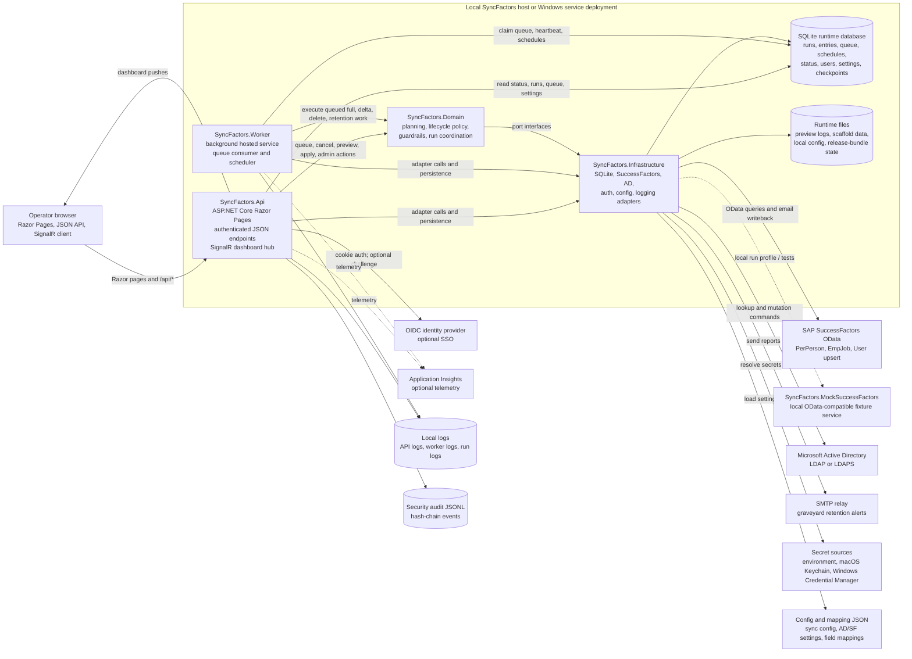
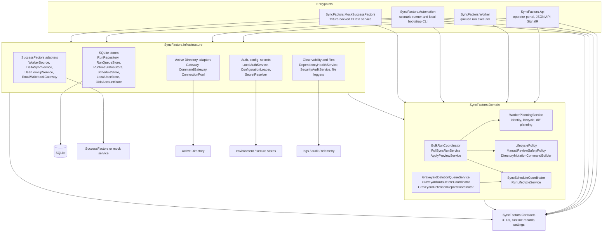
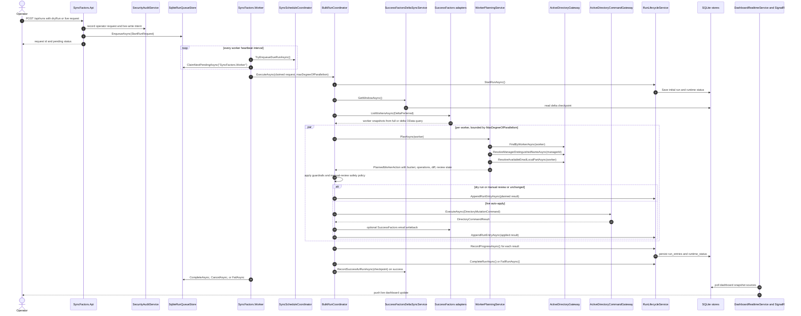

# Current Architecture

SyncFactors is currently a local-first .NET 10 application for operating SuccessFactors-to-Active Directory synchronization with explicit review, dry-run, audit, and Windows deployment paths.

The runtime is split into an ASP.NET Core operator portal/API, a background worker, domain services, infrastructure adapters, and a local mock SuccessFactors service used for development and test automation.

## Technical Architecture Diagram

The diagrams below reflect the current implementation in `src/SyncFactors.Api`, `src/SyncFactors.Worker`, `src/SyncFactors.Domain`, `src/SyncFactors.Infrastructure`, and `src/SyncFactors.MockSuccessFactors`.

### System Context And Runtime Containers

### Codebase Dependency Map

### Queued Sync Execution Flow

### Storage, Auth, And Operations Model

```mermaid
flowchart TB
    subgraph access["Access control"]
        cookie["Cookie auth<br/>SyncFactors.Auth"]
        localAuth["Local break-glass auth<br/>LocalAuthService"]
        oidcAuth["OIDC auth<br/>OpenIdConnect handler"]
        roles["Viewer / Operator / Admin / BreakGlassAdmin policies"]
    end

    subgraph sqlite["SQLite schema version 14"]
        schema["schema_versions"]
        runs["runs"]
        entries["run_entries"]
        status["runtime_status"]
        heartbeat["worker_heartbeat"]
        queue["run_queue"]
        scheduleTable["sync_schedule"]
        deltaState["delta_sync_state"]
        retentionTables["graveyard_retention<br/>graveyard_retention_report_state"]
        settingsTable["dashboard_settings"]
        users["local_users"]
        oidcAccounts["oidc_accounts"]
        maintenance["maintenance_state"]
    end

    subgraph adapters["Infrastructure adapters"]
        sqliteInit["SqliteDatabaseInitializer<br/>schema migration and SQLCipher setup"]
        sqliteRuntime["SQLite stores<br/>runtime status, runs, queue,<br/>schedule, heartbeat, users, settings"]
        sfClient["SuccessFactors HTTP clients<br/>gzip/deflate OData requests"]
        adPool["ActiveDirectoryConnectionPool<br/>LDAP/LDAPS leases, retries, fallback"]
        adCommand["ActiveDirectoryCommandGateway<br/>create, update, move, enable,<br/>disable, delete, group membership"]
        health["DependencyHealthService<br/>SF, AD, worker heartbeat probes"]
        auditSvc["SecurityAuditService<br/>operator/admin audit trail"]
    end

    cookie --> roles
    localAuth --> users
    oidcAuth --> oidcAccounts
    roles --> apiPolicies["Razor conventions and /api groups"]

    sqliteInit --> sqlite
    sqliteRuntime --> sqlite
    sfClient --> sfSystem["SuccessFactors OData"]
    adPool --> adSystem["Active Directory"]
    adCommand --> adPool
    health --> sfClient
    health --> adPool
    health --> heartbeat
    auditSvc --> auditLog[("security audit JSONL")]

    queue --> workerLoop["Worker queue loop"]
    scheduleTable --> workerLoop
    workerLoop --> runs
    workerLoop --> entries
    workerLoop --> status
    workerLoop --> heartbeat
    workerLoop --> deltaState
    workerLoop --> retentionTables
    runs --> dashboard["Dashboard, run detail, exceptions"]
    entries --> dashboard
    status --> dashboard
    settingsTable --> dashboard
```

## Runtime Components

### SyncFactors.Api

`src/SyncFactors.Api` is the operator portal and HTTP API.

Responsibilities:

- Serve Razor Pages for Dashboard, Sync, Exceptions, Worker 360, Lookup, Admin Users, Admin Deletions, and Admin Config
- Expose authenticated JSON endpoints for status, dashboard data, health, runs, queue state, schedules, previews, worker detail, and admin actions
- Host the SignalR dashboard hub at `/hubs/dashboard`
- Enforce role boundaries for Viewer, Operator, Admin, and BreakGlassAdmin access
- Support local break-glass auth, OIDC-only auth, and hybrid OIDC plus break-glass auth
- Remove live-write UI affordances when effective writes are disabled
- Show the shared `DRY RUN MODE` banner when `SyncFactors:Runtime:DryRunOnly` is enabled

### SyncFactors.Worker

`src/SyncFactors.Worker` is the background job runner.

Responsibilities:

- Claim queued runs from SQLite
- Execute ad hoc full syncs, scheduled full syncs, delete-all development reset jobs, and queue recovery probes
- Record runtime status, run summaries, run entries, worker heartbeats, and schedule enqueue results
- Apply the same effective write gate as the API
- Process graveyard retention reporting and configured auto-delete behavior

The worker keeps one active run by default through the run queue/store contract.

### SyncFactors.Domain

`src/SyncFactors.Domain` holds sync behavior and policy.

Responsibilities:

- Worker planning, identity matching, lifecycle bucket decisions, preview/apply planning, and directory mutation command building
- Full-run orchestration and run-entry snapshot generation
- Schedule coordination
- Manual-review safety policy for high-risk disable/delete behavior
- Graveyard deletion queue and retention coordinators
- Dashboard snapshot assembly
- Log-safety helpers and source value normalization

The domain layer stays independent of SQLite, HTTP, PowerShell, and concrete directory or SuccessFactors clients.

### SyncFactors.Infrastructure

`src/SyncFactors.Infrastructure` contains adapters and persistence.

Responsibilities:

- SQLite schema initialization and stores for runs, run entries, runtime status, worker heartbeat, run queue, sync schedule, dashboard settings, local users, OIDC accounts, delta checkpoints, and graveyard retention
- SuccessFactors query, preview, delta, and worker-source logic
- Active Directory lookup and command gateways
- Local auth and OIDC account persistence
- Runtime path resolution, secure-store fallback, file logging, preview logs, and runtime file permission hardening
- Security audit JSONL output with integrity chaining
- SMTP alert delivery and dependency health probes

### SyncFactors.Contracts

`src/SyncFactors.Contracts` contains DTOs and shared runtime records used across API, worker, domain, and tests.

### SyncFactors.MockSuccessFactors

`src/SyncFactors.MockSuccessFactors` provides the local SuccessFactors-like service and CLI helpers used for fixture playback, sanitized fixture generation, metadata/query testing, and deterministic lifecycle simulation.

## Operator Surface

Current portal pages:

- Dashboard: runtime status, active run summary, recent run timeline, health probes, run mix, and change composition
- Sync: current run, ad hoc run queueing, cancellation, recurring schedule management, recent runs, and development delete-all reset when allowed
- Exceptions: triage queue for failed runs, manual review, conflicts, and guardrail failures
- Worker 360: source summary, directory match, decision tree, preview history, previous-preview comparison, apply readiness, attribute diff, source confidence, run history, and preview entries
- Lookup: SuccessFactors user lookup plus raw OData and flattened attribute inspection
- Admin Users: local break-glass user management or SSO group visibility, depending on auth mode
- Admin Deletions: graveyard deletion workbench with pending and on-hold queues
- Admin Config: current deployment, authentication, SuccessFactors, Active Directory, operations, safety, alerts, and mapping configuration snapshot

## Storage Model

SQLite remains the default local runtime store. The current schema is managed by `SqliteDatabaseInitializer` and includes:

- `schema_versions`
- `runs`
- `run_entries`
- `runtime_status`
- `worker_heartbeat`
- `graveyard_retention`
- `graveyard_retention_report_state`
- `dashboard_settings`
- `oidc_accounts`
- `maintenance_state`
- `run_queue`
- `sync_schedule`
- `delta_sync_state`
- `local_users`

Run history is pruned according to sync policy settings, and maintenance can vacuum the database after enough free space has accumulated.

## External Boundaries

### SuccessFactors

The production source is a typed OData client over configured `PerPerson` preview and `EmpJob` full-sync query shapes. Supported auth modes are Basic and OAuth client credentials. The mock service supports the query shapes used by the current client for local development and automated lifecycle simulation.

### Active Directory

Directory access is isolated behind lookup and command gateway interfaces. The Windows service deployment is designed to bind with the service identity when `ad.username` and `ad.bindPassword` are blank. Explicit bind credentials are still supported when required.

### Secrets

The runtime resolves sensitive values from environment variables first, then from platform secure stores used by the launchers where applicable:

- macOS Keychain for Codex/local worktrees
- Windows Credential Manager for Windows launch and service workflows

Tracked config files must contain placeholders only.

### Observability

The API and worker support:

- Structured logging through `ILogger`
- Optional local rolling file logs
- Optional Application Insights when a connection string or compatible instrumentation key setting is present
- Run-scoped log files
- Worker heartbeat state
- Dependency health probes
- Security audit events with hash-chain integrity

## Delivery And Validation

Primary validation:

- `dotnet build ./SyncFactors.Next.sln`
- `dotnet test ./SyncFactors.Next.sln`
- `pwsh ./scripts/Validate-SyncFactors.ps1`
- `npm ci --ignore-scripts`, `npm run test:ui`, and `npm run build:ui` from `src/SyncFactors.Api` when touching the UI bundle

CI currently includes GitHub Actions for .NET build/test, frontend tests/build, lifecycle simulation master coverage, SBOM generation, SonarCloud, Semgrep, Gitleaks, Trivy, dependency review, CodeQL, and release packaging.

Windows deployment is supported through the release bundle scripts and `azure-pipelines.deploy.yml`, which builds, tests, packages, and optionally deploys the self-contained API and worker services over WinRM.
