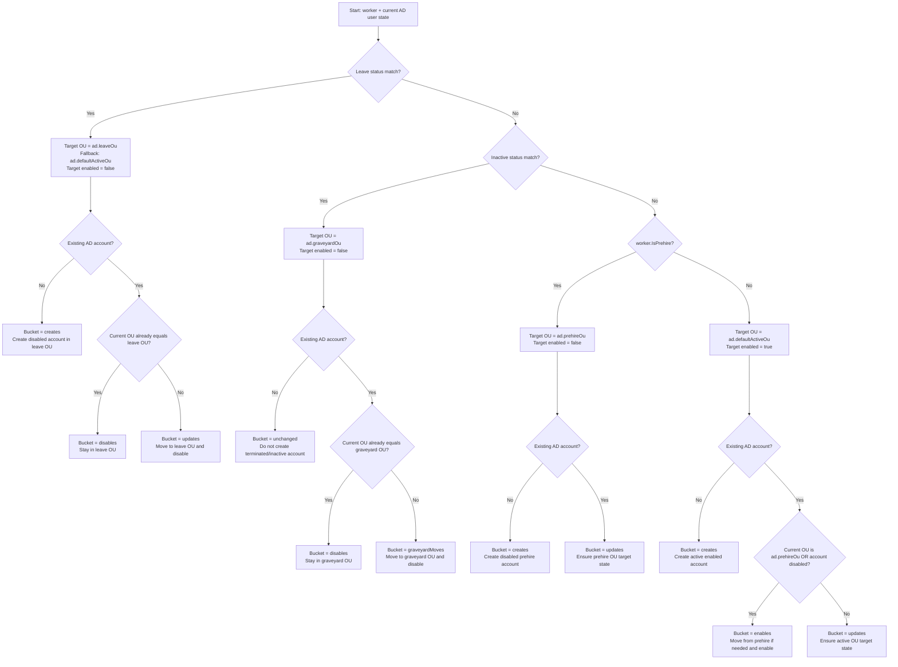

# OU Decision Tree

This mirrors the current `LifecyclePolicy.Evaluate(...)` implementation in [src/SyncFactors.Domain/LifecyclePolicy.cs](/Users/chrisbrien/dev/github.com/syncfactors/src/SyncFactors.Domain/LifecyclePolicy.cs:8). The config inputs are assembled in [src/SyncFactors.Api/Program.cs](/Users/chrisbrien/dev/github.com/syncfactors/src/SyncFactors.Api/Program.cs:103).

## Decision Tree

## Precedence

The checks are ordered, and the first match wins:

1. Leave status
2. Inactive or terminated status
3. Prehire flag
4. Active fallback

That means a worker with both a leave-coded status and `IsPrehire=true` still goes down the leave branch.

## What Counts As A Status Match

Both the leave and inactive checks read the same configured source field:

- `successFactors.query.inactiveStatusField`

The lookup is forgiving and will try equivalent source keys before giving up, including:

- the configured key as-is
- a normalized path form
- an indexed navigation path form
- the leaf field name
- common employment status aliases such as `emplStatus`, `employeeStatus`, `employeestatus`, `employmentNav[0].jobInfoNav[0].emplStatus`, and `employmentNav/jobInfoNav/emplStatus`

The configured value sets are then compared case-insensitively:

- leave branch: `sync.leaveStatusValues`
- inactive or graveyard branch: `successFactors.query.inactiveStatusValues`

## Important Notes

- The source worker is initially created with `TargetOu = ad.defaultActiveOu` in [src/SyncFactors.Infrastructure/SuccessFactorsWorkerSource.cs](/Users/chrisbrien/dev/github.com/syncfactors/src/SyncFactors.Infrastructure/SuccessFactorsWorkerSource.cs:1283), but the lifecycle policy overrides that with the final OU decision.
- The only branch that explicitly refuses to create a missing account is the inactive or terminated branch. If no AD account exists there, the result is `unchanged` with target OU still set to the graveyard OU.
- If `ad.leaveOu` is not configured, leave users fall back to `ad.defaultActiveOu` but remain disabled.
