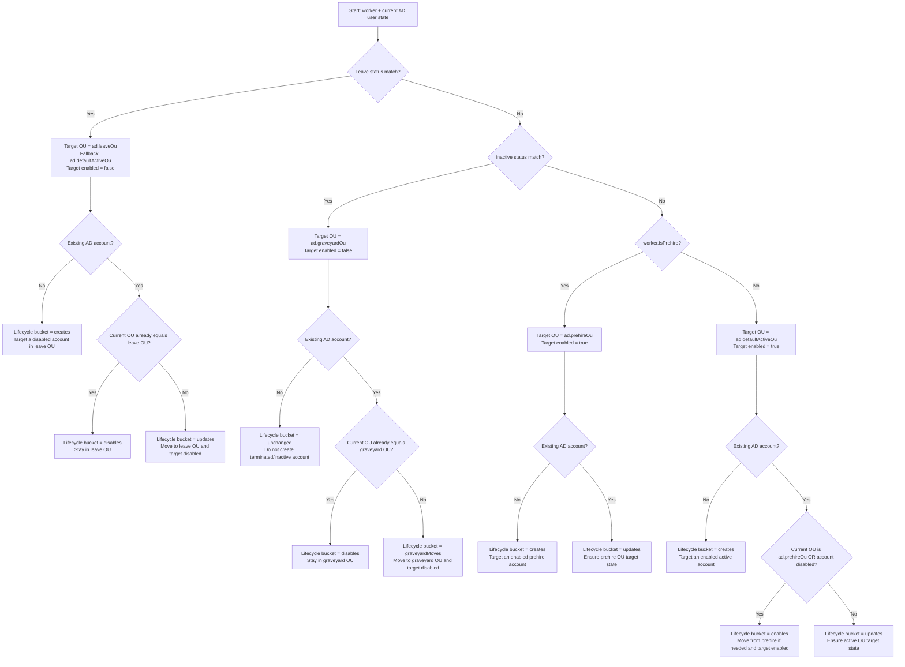

# OU Decision Tree

This mirrors the lifecycle classification performed by `LifecyclePolicy.Evaluate(...)` in [`src/SyncFactors.Domain/LifecyclePolicy.cs`](../src/SyncFactors.Domain/LifecyclePolicy.cs). The config inputs are assembled during API and worker startup from the active sync config.

The buckets in this decision tree are **provisional lifecycle buckets**, not necessarily the final provisioning result. [`WorkerPlanningService`](../src/SyncFactors.Domain/WorkerPlanningService.cs) derives concrete directory operations from the current AD state and mapped attribute diff, then can rebucket the worker as `unchanged`, `updates`, `enables`, `disables`, or `manualReview`. The directory gateway can also constrain create-time enablement based on the effective LDAP transport.

## Decision Tree

```mermaid
flowchart TD
    A["Start: worker + current AD user state"] --> B{"Leave status match?"}

    B -->|Yes| C["Target OU = ad.leaveOu<br/>Fallback: ad.defaultActiveOu<br/>Target enabled = false"]
    C --> D{"Existing AD account?"}
    D -->|No| E["Lifecycle bucket = creates<br/>Target a disabled account in leave OU"]
    D -->|Yes| F{"Current OU already equals leave OU?"}
    F -->|Yes| G["Lifecycle bucket = disables<br/>Stay in leave OU"]
    F -->|No| H["Lifecycle bucket = updates<br/>Move to leave OU and target disabled"]

    B -->|No| I{"Inactive status match?"}
    I -->|Yes| J["Target OU = ad.graveyardOu<br/>Target enabled = false"]
    J --> K{"Existing AD account?"}
    K -->|No| L["Lifecycle bucket = unchanged<br/>Do not create terminated/inactive account"]
    K -->|Yes| M{"Current OU already equals graveyard OU?"}
    M -->|Yes| N["Lifecycle bucket = disables<br/>Stay in graveyard OU"]
    M -->|No| O["Lifecycle bucket = graveyardMoves<br/>Move to graveyard OU and target disabled"]

    I -->|No| P{"worker.IsPrehire?"}
    P -->|Yes| Q["Target OU = ad.prehireOu<br/>Target enabled = true"]
    Q --> R{"Existing AD account?"}
    R -->|No| S["Lifecycle bucket = creates<br/>Target an enabled prehire account"]
    R -->|Yes| T["Lifecycle bucket = updates<br/>Ensure prehire OU target state"]

    P -->|No| U["Target OU = ad.defaultActiveOu<br/>Target enabled = true"]
    U --> V{"Existing AD account?"}
    V -->|No| W["Lifecycle bucket = creates<br/>Target an enabled active account"]
    V -->|Yes| X{"Current OU is ad.prehireOu OR account disabled?"}
    X -->|Yes| Y["Lifecycle bucket = enables<br/>Move from prehire if needed and target enabled"]
    X -->|No| Z["Lifecycle bucket = updates<br/>Ensure active OU target state"]
```

## Effective Provisioning Behavior

After lifecycle classification, the planner emits only the operations that are actually needed, in this order for an existing account: `MoveUser`, `UpdateUser`, then `EnableUser` or `DisableUser`. A worker with no resulting operations is rebucketed as `unchanged`.

| Source and directory case | Concrete behavior | Planner bucket behavior |
| --- | --- | --- |
| Leave worker, no AD account | Create in the leave OU with the account targeted disabled. Required-mapping and diff validation still run because this is a create. | `creates` when validation passes |
| Leave worker, existing account | Move to the leave OU if needed, update changed mapped attributes, and disable only when not already disabled. | `disables` when a disable is needed; otherwise `updates` when a move/update is needed; otherwise `unchanged` |
| Inactive/terminated worker, no AD account | Do not create an account. Skip email resolution, mapped diff generation, and required-mapping validation. | `unchanged` |
| Inactive/terminated worker, existing account outside graveyard | Move to the graveyard OU, update changed mapped attributes, and disable if needed. The gateway performs read-after-write verification that the account is in the graveyard OU and disabled. | `graveyardMoves` |
| Inactive/terminated worker, existing account already in graveyard | Update changed mapped attributes and disable only when needed. | `disables`, `updates`, or `unchanged` according to the operations actually needed |
| Prehire worker, no AD account | Create in the prehire OU with the account targeted enabled. | `creates` |
| Prehire worker, existing account | Move to the prehire OU, update changed mapped attributes, and enable only when needed. | `enables` when enablement is needed; otherwise `updates` or `unchanged` |
| Active worker, no AD account | Create in the active OU with the account targeted enabled. | `creates` |
| Active worker, existing disabled account or account in the prehire OU | Move to the active OU if needed, update changed mapped attributes, and enable if disabled. | `enables` |
| Active worker, other existing account | Move to the active OU if needed and update changed mapped attributes. | `updates` when work is needed; otherwise `unchanged` |

### Planner Holds And Overrides

These checks can replace the lifecycle result before any AD write occurs:

- Ambiguous worker identity, a mismatched `sAMAccountName` identity, source data marked for review, an ambiguous manager identity, or conflicting identity-correlation data produces `manualReview` with no operations.
- A manager lookup that merely fails or returns no match does **not** block provisioning; planning continues without a manager update.
- Missing required mapped source values produce `unchanged` with no operations rather than `manualReview`.
- When identity correlation shows that an identity targeting disabled was superseded by a linked successor, disablement is suppressed and the result is `unchanged`. This applies to both inactive/terminated and leave-coded workers because the correlation check keys off `TargetEnabled == false`.
- When disable manual review is configured, an otherwise planned `DisableUser` in a `disables` or `graveyardMoves` case is held as `manualReview`.
- Per-run create and disable limits can rebucket planned work as `guardrailFailures`. Planning or directory execution exceptions are recorded as `conflicts`.
- Within one run, duplicate proposed create email addresses are reserved by appending the first available numeric suffix from `2` through `999`; the UPN, mail, and primary proxy-address changes are rewritten to that reserved address.

The full-sync execution layer has one additional bucket rule: an `updates` plan with no changed mapped attributes is recorded as `unchanged`, even when it still contains a move-only `MoveUser` operation. `CanAutoApply` and the operation list are not cleared, so a live run still performs that move. This means the recorded run bucket can say `unchanged` for a leave, prehire, or active OU-only move.

### Create-Time Enablement And Groups

- New users are initially added as disabled AD objects. With effective `ldaps` or `starttls`, the gateway sets a generated password and then enables the account when the plan targets enabled.
- With plain `ldap`, the gateway cannot provision `unicodePwd`. It leaves a new active or prehire account disabled unless `ad.transport.allowCreateEnableWithoutPasswordProvisioning` is `true`.
- Configured licensing/provisioning groups are added only when the command targets an enabled state and its target OU exactly equals `ad.defaultActiveOu`. Normally, distinct prehire, leave, and graveyard OUs therefore do not receive those groups.
- Group memberships are intentionally retained when a user is disabled or moved to leave/graveyard; they are not removed until account deletion.

### After A Graveyard Move

- Each planned existing account whose target is the disabled graveyard state upserts an active retention record. A later plan outside that state resolves the record.
- The deletion queue includes an active retention record only while the corresponding AD account can still be found in the configured graveyard OU, matched by directory identity or recorded distinguished name.
- The deletion due date is the source end date, when available, otherwise the last-observed date, plus the configured retention period. Held records remain visible separately and are excluded from automatic deletion.
- Automatic deletion runs only when `sync.autoDeleteFromGraveyard` is enabled and processes pending, due records. Deletion manual-review policy, the per-run deletion limit, live-write availability, and directory failures can still prevent deletion.
- A successful deletion resolves the retention record; blocked work is recorded as `manualReview`, `guardrailFailures`, or `conflicts` as applicable.

## Precedence

The checks are ordered, and the first match wins:

1. Leave status
2. Inactive or terminated status
3. Prehire flag
4. Active fallback

That means a worker with both a leave-coded status and `IsPrehire=true` still goes down the leave branch.

## What Counts As A Status Match

Both the leave and inactive checks read the same configured source field:

- `successFactors.query.inactiveStatusField`

The lookup is forgiving and will try equivalent source keys before giving up, including:

- the configured key as-is
- a normalized path form
- an indexed navigation path form
- the leaf field name
- common employment status aliases such as `emplStatus`, `employeeStatus`, `employeestatus`, `employmentNav[0].jobInfoNav[0].emplStatus`, and `employmentNav/jobInfoNav/emplStatus`

The configured value sets are then compared case-insensitively:

- leave branch: `sync.leaveStatusValues`
- inactive or graveyard branch: `successFactors.query.inactiveStatusValues`

## Important Notes

- The source worker is initially created with `TargetOu = ad.defaultActiveOu` in [`src/SyncFactors.Infrastructure/SuccessFactorsWorkerSource.cs`](../src/SyncFactors.Infrastructure/SuccessFactorsWorkerSource.cs), but the lifecycle policy overrides that with the final OU decision.
- At the lifecycle-policy layer, the only branch that explicitly refuses to create a missing account is the inactive or terminated branch. Planner review and validation holds can suppress creates in the other branches.
- If `ad.leaveOu` is not configured, leave users fall back to `ad.defaultActiveOu` but remain disabled.
