<section class="cover">
  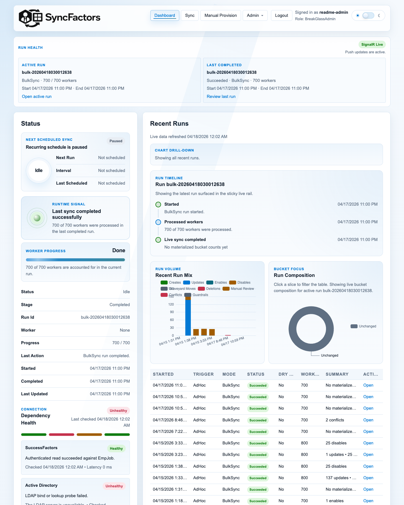
  <h1>SyncFactors UI User Manual</h1>
  <h2>Operator and Administrator Guide</h2>
  
<strong>Application:</strong> SyncFactors — SuccessFactors to Active Directory synchronization 
  <strong>Manual source:</strong> Editable Markdown 
  <strong>Screenshot build:</strong> <code>v0.1.1004+sha.fa227b3.dirty</code> 
  <strong>Captured:</strong> July 23, 2026 
  <strong>Status:</strong> Alpha software

</section>

> [!WARNING]
> SyncFactors is alpha software. Validate every workflow in a non-production environment before enabling live Active Directory writes. Use dry runs as the default operating mode.

## Contents

1. [Purpose and scope](#1-purpose-and-scope)
2. [Roles and permissions](#2-roles-and-permissions)
3. [Sign in](#3-sign-in)
4. [Navigate the application](#4-navigate-the-application)
5. [Use the Dashboard](#5-use-the-dashboard)
6. [Queue and manage sync runs](#6-queue-and-manage-sync-runs)
7. [Review Exceptions](#7-review-exceptions)
8. [Inspect Run Detail](#8-inspect-run-detail)
9. [Use Worker 360](#9-use-worker-360)
10. [Use raw SuccessFactors Lookup](#10-use-raw-successfactors-lookup)
11. [Administer user access](#11-administer-user-access)
12. [Manage the deletion queue](#12-manage-the-deletion-queue)
13. [Review effective configuration](#13-review-effective-configuration)
14. [Change theme or sign out](#14-change-theme-or-sign-out)
15. [Recommended operating workflow](#15-recommended-operating-workflow)
16. [Troubleshooting](#16-troubleshooting)
17. [Glossary](#17-glossary)

## 1. Purpose and scope

SyncFactors is an operator portal for reviewing and controlling synchronization from SAP SuccessFactors to Microsoft Active Directory. The UI supports:

- runtime and dependency health monitoring;
- ad hoc dry-run and live synchronization requests;
- recurring schedule management;
- run history, run detail, entry filtering, and exports;
- exception triage;
- single-worker preview and guarded apply through Worker 360;
- read-only SuccessFactors OData lookup;
- local break-glass or SSO access administration;
- graveyard deletion review and reversible holds; and
- effective, non-secret configuration review.

This manual explains the current browser UI. Deployment, service installation, secret storage, Active Directory delegation, and SuccessFactors API configuration are outside this UI-focused guide.

### Screenshot convention

Orange boxes identify an interaction area. The orange number corresponds to the numbered explanation directly below the image. Screenshots use the dark theme; the same controls are present in light and system themes. Data, role-dependent controls, and environment banners will vary by deployment.

## 2. Roles and permissions

| Role | Typical UI permissions |
| --- | --- |
| **Viewer** | View dashboards, runtime status, health information, run history, run detail, and worker previews. |
| **Operator** | Includes Viewer access; can queue syncs, generate previews, apply eligible previews, and cancel runs. |
| **Admin** | Includes Operator access; can manage schedules, configuration visibility, deletion holds and approvals, local users, SSO access visibility, and development-only reset operations. |
| **BreakGlassAdmin** | Local emergency administrator used when break-glass authentication is enabled. It receives administrator-level UI access. |

Controls are hidden or blocked when your role does not permit the action. If a page or menu described here is absent, first confirm your assigned role and the deployment authentication mode.

## 3. Sign in

The sign-in page changes according to the configured authentication mode:

- **OIDC:** use **Sign in with SSO**.
- **Hybrid:** SSO is primary; local break-glass sign-in is also available.
- **Local break-glass:** enter a local username and password.

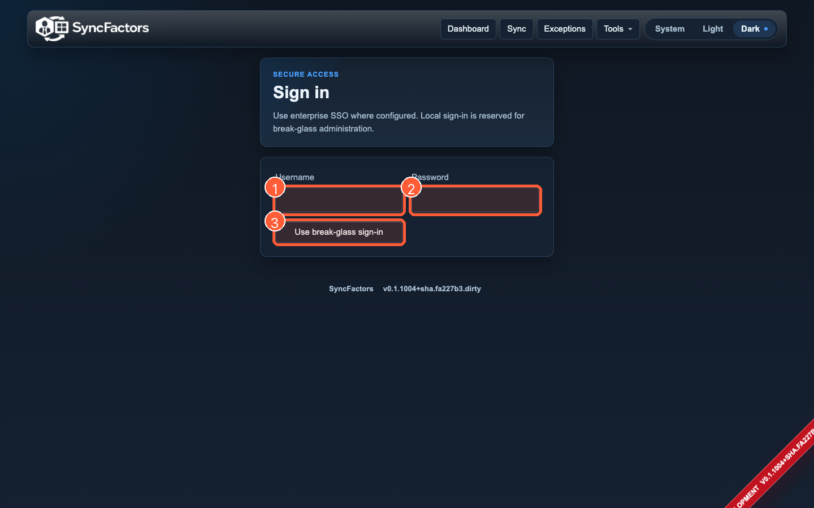

1. Enter the local **Username** when local break-glass access is enabled.
2. Enter the local **Password**.
3. Select **Use break-glass sign-in**. In an SSO-enabled deployment, select **Sign in with SSO** instead.

A deployment may optionally show **Remember my login**. Use it only on an approved administrative workstation. Failed local sign-ins can trigger account lockout according to the configured policy.

## 4. Navigate the application

The top navigation remains visible throughout the portal.

| Navigation item | Purpose |
| --- | --- |
| **Dashboard** | Runtime status, health, schedule, recent runs, charts, and active-run cancellation. |
| **Sync** | Queue an ad hoc run, manage a recurring schedule, cancel a run, and inspect run history. |
| **Exceptions** | Review failed runs, manual reviews, conflicts, and guardrail failures. |
| **Tools → Worker 360** | Preview and inspect one worker; apply an eligible saved preview. |
| **Tools → Lookup** | Perform a read-only SuccessFactors OData lookup. |
| **Admin → Users** | Review SSO access or manage local break-glass users. |
| **Admin → Deletions** | Review graveyard retention records, approve eligible deletion, and manage holds. |
| **Admin → Config** | Review the effective non-secret deployment configuration. |

### Tools menu

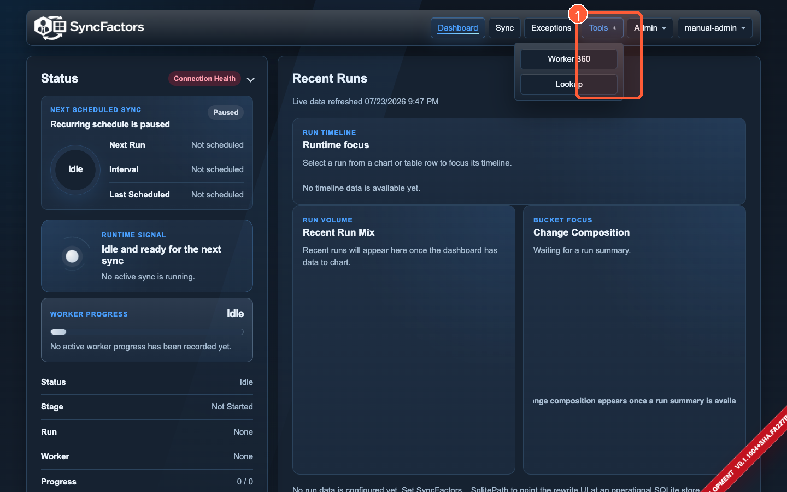

1. Select **Tools**, then choose **Worker 360** or **Lookup**.

### Admin menu

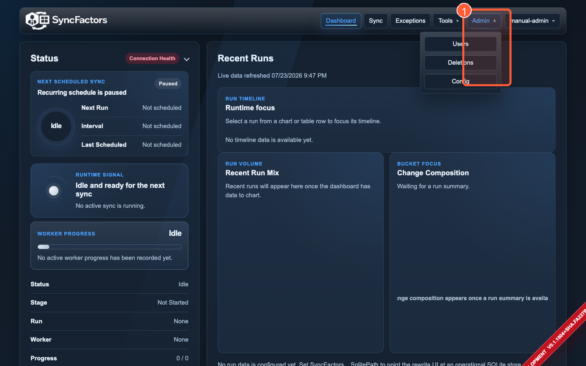

1. Administrators select **Admin**, then choose **Users**, **Deletions**, or **Config**. The entire Admin menu is hidden for non-administrators.

## 5. Use the Dashboard

The Dashboard is the starting point for daily operations. It combines runtime state, schedule information, dependency health, recent runs, and run analytics.

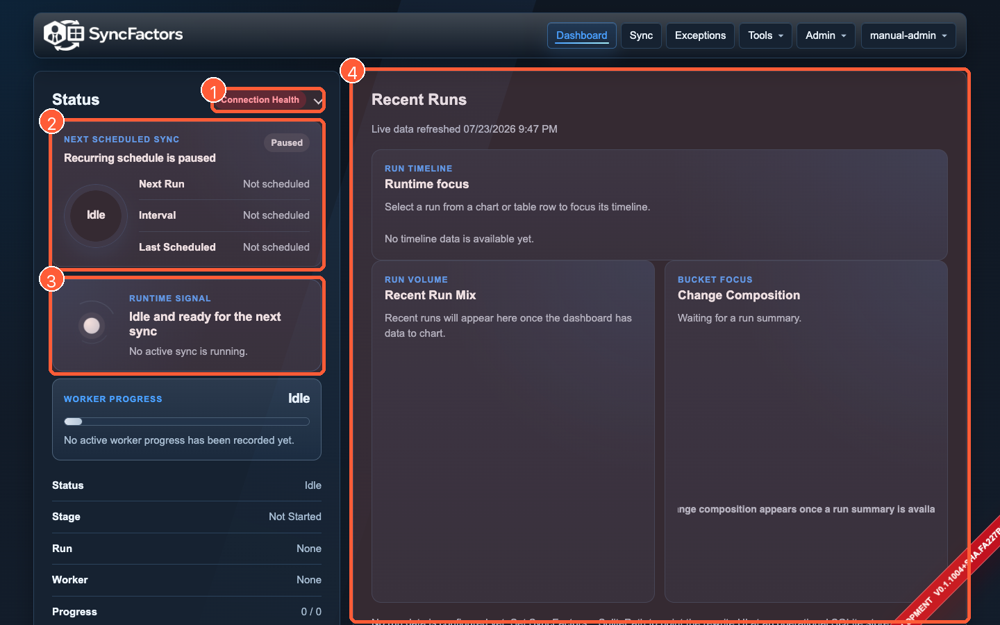

1. Open **Connection Health** to inspect SuccessFactors, Active Directory, Worker Service, and SQLite status. A disabled or waiting badge is not the same as a successful probe.
2. Review **Next Scheduled Sync** before queuing an ad hoc run. Confirm whether the schedule is enabled and when it will run next.
3. Review the **Runtime Signal** and worker progress. During an active or queued run, this area shows stage, worker, counts, and a **Cancel run** action when your role permits cancellation.
4. Use **Recent Runs**, the run timeline, and analytics to identify the latest result. Select **Open** on a run row to view Run Detail.

### Interpret common dashboard states

| State | Meaning | Recommended response |
| --- | --- | --- |
| **Idle** | No queued or active run is being processed. | Safe time to review settings or queue a dry run. |
| **Pending / Planned** | A run is queued and waiting for the worker. | Confirm the Worker Service is healthy. |
| **In Progress** | The worker has claimed and is processing a run. | Monitor stage, worker count, and exceptions. |
| **Cancel Requested** | Graceful cancellation has been requested. | Wait for the worker to stop and record the final state. |
| **Succeeded** | The run completed without a run-level failure. | Review bucket counts and unexpected changes. |
| **Failed** | The run stopped with an error. | Open Run Detail and Exceptions; do not immediately switch to live mode. |

### Connection health

The connection menu reports each dependency separately. A partially healthy deployment can still render the portal while being unable to execute a successful sync. For example, SQLite can be healthy while Active Directory is unavailable.

Administrators may see development-only controls to enable or disable dashboard probes and set their frequency. Changing probe frequency affects monitoring, not synchronization behavior.

## 6. Queue and manage sync runs

Open **Sync** to control ad hoc and scheduled synchronization.

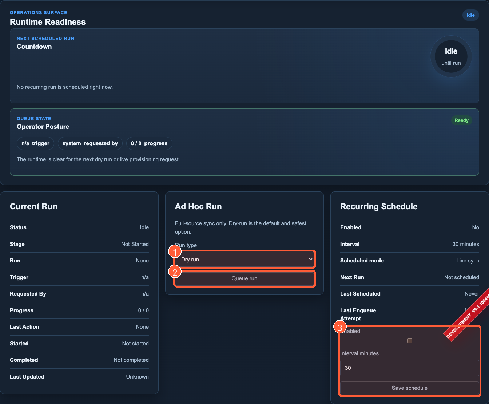

1. Choose a **Run type**. Keep **Dry run** selected for routine validation. **Live provisioning** appears only when live writes are enabled by deployment and sync policy.
2. Select **Queue run**. When a run is already pending or active, this control changes to **Cancel run**.
3. Administrators use **Recurring Schedule** to enable or pause the schedule, set an interval from 5 to 1,440 minutes, and select **Save schedule**.

### Queue a dry run

1. Confirm the **Runtime Readiness** area says the queue is ready.
2. Confirm the scheduled countdown will not create an unintended overlap.
3. In **Ad Hoc Run**, select **Dry run**.
4. Select **Queue run** once.
5. Return to **Dashboard** or remain on **Sync** to monitor the queued request.
6. After completion, open the run and review buckets, exceptions, and worker-level diffs.

A dry run plans and records the expected Active Directory outcome without applying directory changes. It should be the default first step after configuration changes, mapping changes, source-data changes, or a failed run.

### Queue a live provisioning run

> [!CAUTION]
> Live provisioning writes to Active Directory. Do not proceed until an equivalent dry run has completed and the resulting changes, counts, target OUs, and exceptions have been reviewed.

1. Verify that the deployment does **not** display a **DRY RUN MODE** banner.
2. Complete and review a fresh dry run.
3. Confirm dependency health, especially Active Directory and Worker Service.
4. Select **Live provisioning** from **Run type**.
5. Select **Queue run**.
6. Monitor the run until it reaches a terminal state.
7. Open Run Detail and verify creates, updates, enables, disables, graveyard moves, and failures.

If **Live provisioning** is absent, live writes are disabled by deployment policy, sync configuration, or both. Do not attempt to bypass that safety state from the browser.

### Cancel a queued or active run

- On **Dashboard**, use **Cancel run** in the worker progress area.
- On **Sync**, the normal queue button changes to **Cancel run** while a request is pending or active.

Cancellation is graceful. The worker may finish the current operation before it stops. Wait for the final run status before queuing another run.

### Manage the recurring schedule

Administrators can:

1. Select or clear **Enabled**.
2. Enter the interval in minutes.
3. Select **Save schedule**.
4. Verify the next run time on both **Sync** and **Dashboard**.

When live provisioning is disabled, scheduled runs are forced to dry-run mode even if the underlying schedule remains enabled.

### Development-only Testing Reset

A **Testing Reset** button can appear for administrators in Development. It opens a destructive **Delete All Users** dialog and requires the exact confirmation phrase `DELETE ALL USERS`.

> [!DANGER]
> This queues a live deletion job against users in configured Active Directory test OUs. Use it only in an isolated test environment with verified test-only OUs. It is not a normal operational recovery tool.

## 7. Review Exceptions

Open **Exceptions** to triage actionable run outcomes from one queue.

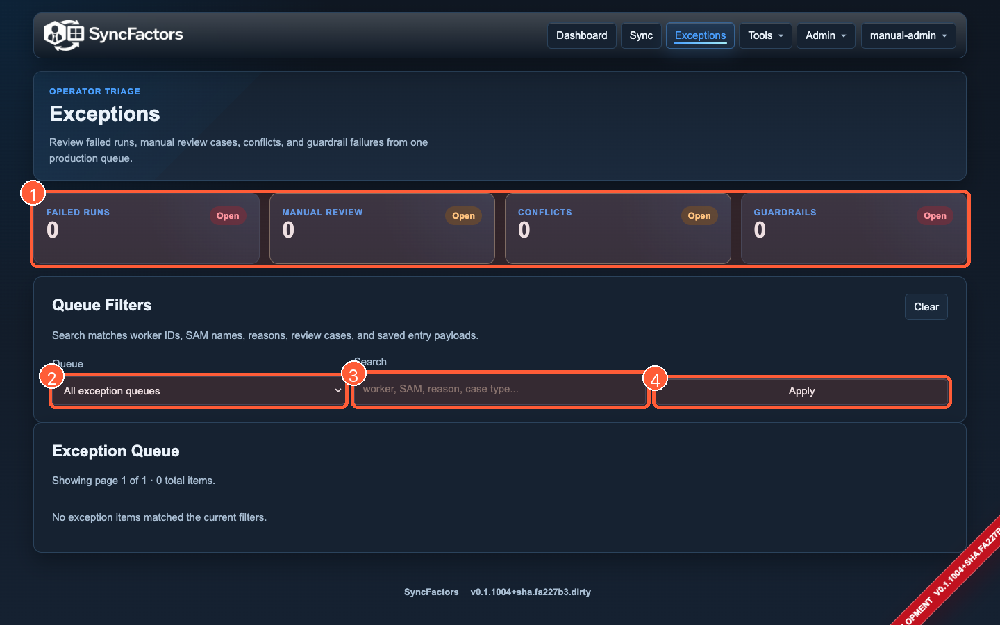

1. Select a summary card to focus on **Failed Runs**, **Manual Review**, **Conflicts**, or **Guardrail Failures**.
2. Use **Queue** to choose one exception category or all queues.
3. Enter a **Search** value. Search covers worker IDs, SAM names, reasons, review case types, and saved entry payloads.
4. Select **Apply**. Use **Clear** to remove all filters.

Each exception card can offer:

- **Open run** — opens the parent Run Detail page;
- **Open decision** — opens the exact saved run entry and decision context; and
- **Preview worker** — opens the worker in Worker 360 when a worker ID is available.

### Suggested triage order

1. **Failed Runs** — determine whether the entire run stopped.
2. **Guardrail Failures** — review safety limits before any retry.
3. **Conflicts** — resolve ambiguous or duplicate identity matches.
4. **Manual Review** — inspect worker-specific decisions and determine whether a supported apply path exists.

Do not clear an exception merely by rerunning. Confirm the underlying mapping, identity, source, connectivity, or policy issue is resolved.

## 8. Inspect Run Detail

Open Run Detail by selecting **Open** from Dashboard or Sync history, or **Open run** from Exceptions.

The page provides:

- run identity, mode, trigger, requestor, timestamps, and status;
- bucket counts for creates, updates, enables, disables, graveyard moves, conflicts, guardrail failures, manual reviews, and unchanged workers;
- population comparison when available;
- worker ID and text filters;
- employment-status chips;
- changed-attribute totals;
- per-entry execution summary and diagnostics;
- a provisioning decision tree for a selected entry;
- saved-preview links; and
- JSON, JSONL, and CSV exports.

### Filter run entries

1. Enter a worker ID or `samAccountName` in **Worker search**.
2. Optionally enter reason, review case type, or saved entry text in **Text search**.
3. Select **Apply**.
4. Select a bucket tile or employment-status chip to narrow the list further.
5. Select **Clear** to return to all entries.

### Open an entry

Select the entry-detail link in a run entry. Entry Detail displays the historical snapshot recorded during that run. It is not a fresh SuccessFactors lookup and not a newly generated preview.

### Export matching entries

1. Apply the desired filters.
2. Open **Export**.
3. Choose:
   - **JSON** for a structured document;
   - **JSONL** for one metadata record followed by one entry record per line; or
   - **CSV** for tabular analysis.

Exports include the full matching result set, not only the current page.

## 9. Use Worker 360

Worker 360 is the primary single-worker investigation and guarded apply surface.

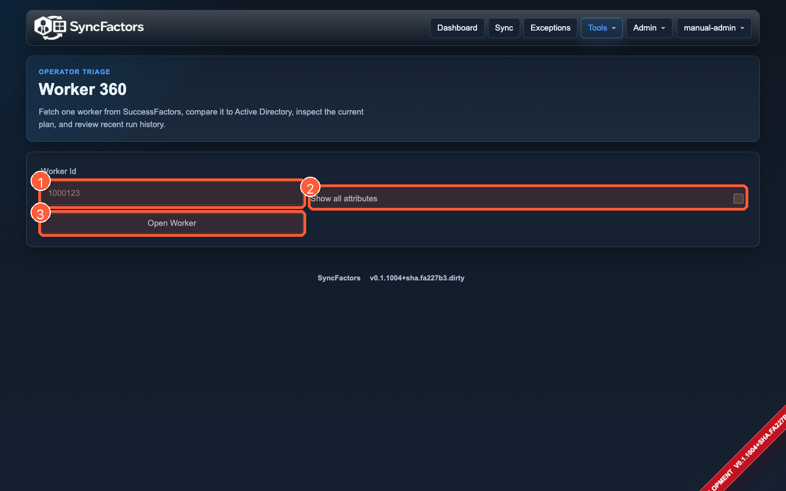

1. Enter the SuccessFactors **Worker Id**.
2. Select **Show all attributes** when you need unchanged attributes as well as changed attributes. Leave it clear for a focused changed-attribute view.
3. Select **Open Worker**.

A successful preview can include:

- normalized source summary;
- Active Directory match and current DN;
- target OU and proposed enabled state;
- planned action and primary bucket;
- risk posture and missing source attributes;
- saved preview fingerprint;
- provisioning decision tree;
- previous-preview comparison and preview history;
- grouped attribute diff;
- source confidence; and
- recent worker run history.

### Review a preview safely

1. Confirm the worker ID and source summary.
2. Confirm whether an existing directory user was matched.
3. Review target OU, manager, enabled state, and planned action.
4. Read every risk or guardrail callout.
5. Review the provisioning decision tree.
6. Inspect changed attributes, especially identity, routing, manager, lifecycle, and access-related fields.
7. Compare the preview to the previous saved preview when available.
8. Treat the saved fingerprint as the exact reviewed snapshot.

### Apply a saved preview

When live writes are enabled and your role permits apply, the **Apply Guardrail** section displays:

- a statement that the saved preview, not a silent re-run, will be used;
- an acknowledgement checkbox;
- the reviewed preview fingerprint; and
- **Real Sync To AD**.

> [!CAUTION]
> This action writes to Active Directory. Apply only after reviewing the complete saved preview. The server rejects a stale fingerprint instead of silently applying a changed plan.

1. Review the entire preview.
2. Select **I understand this will perform a real sync to AD using the saved preview**.
3. Select **Real Sync To AD**.
4. Review the returned verification details and linked run.

If the apply section says the preview is available for dry-run review only, live writes are disabled. Do not attempt to work around that restriction.

## 10. Use raw SuccessFactors Lookup

Lookup is a read-only diagnostic tool. It calls SuccessFactors directly and does not use the sync planner, run queue, mapping, or scaffold fallback.

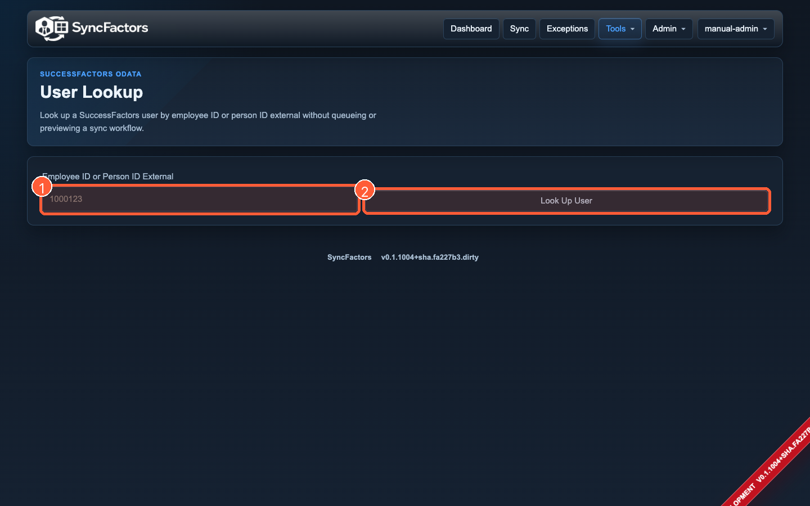

1. Enter an **Employee ID or Person ID External**.
2. Select **Look Up User**.

Results can include:

- match and retrieval summary;
- flattened entity, path, and value rows; and
- expandable raw OData responses for each entity call.

Use Lookup when Worker 360 reports missing or unexpected source data. A successful raw lookup does not prove that mapping, identity matching, or Active Directory provisioning will succeed.

## 11. Administer user access

Open **Admin → Users**. The page changes by authentication mode.

### OIDC or hybrid access

The page shows configured SSO groups, the access level each group grants, and accounts recorded after successful SSO login. The identity provider remains the authority for current group membership. A recorded account can remain visible after its IdP group membership is removed.

### Local break-glass user management

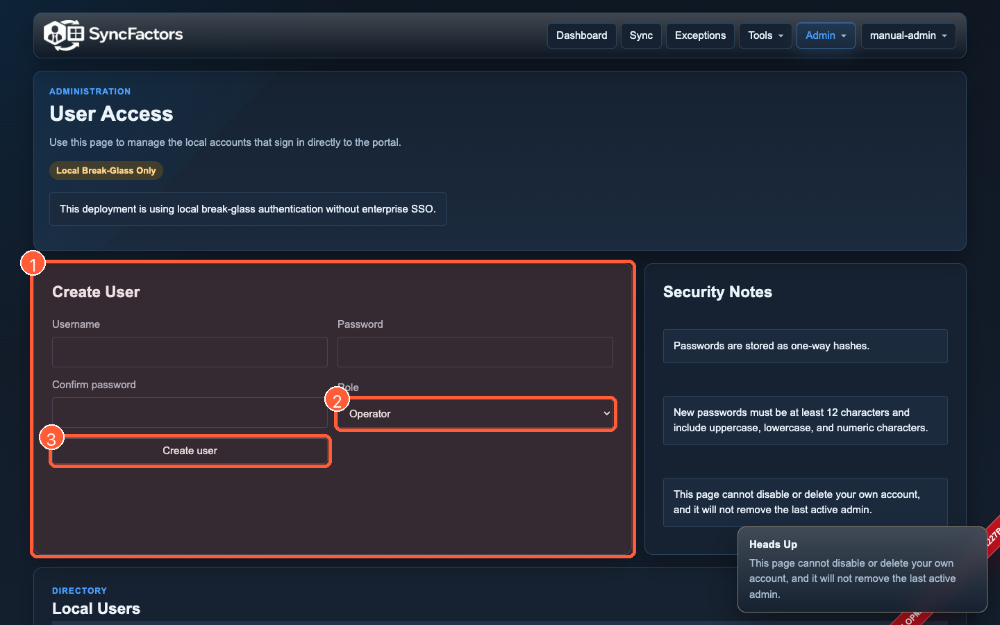

1. Complete the **Create User** form with username, password, confirmation, and role.
2. Choose **Viewer**, **Operator**, or **Admin**.
3. Select **Create user**.

Local passwords must be at least 12 characters and include uppercase, lowercase, and numeric characters. Passwords are stored as one-way hashes.

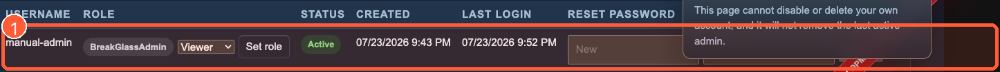

1. Use the Local Users table to change a role, reset a password, enable or disable an account, or delete an account.

Safety rules prevent an administrator from disabling or deleting their own account and prevent removal of the last active administrator.

### SSO-only deployments

Local account creation and password controls are hidden. Create, disable, delete, and assign users in the enterprise identity provider and configured groups.

## 12. Manage the deletion queue

Open **Admin → Deletions** to review graveyard retention records.

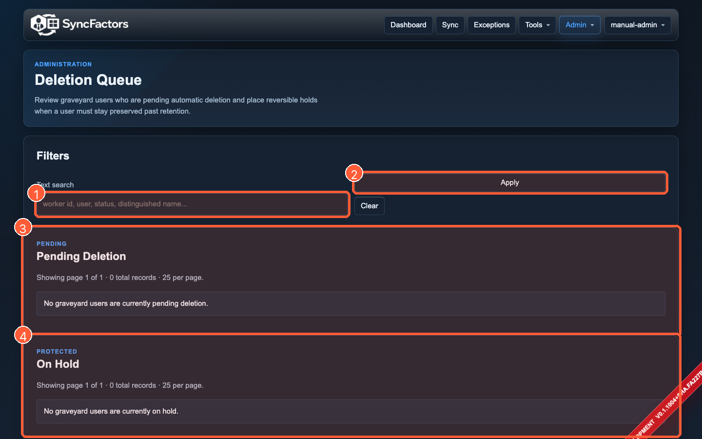

1. Search by worker ID, user, status, or distinguished name.
2. Select **Apply**. Use **Clear** to reset the filter.
3. Review **Pending Deletion**. Eligible rows can show **Approve delete** and every pending row can show **Place hold**.
4. Review **On Hold**. Use **Remove hold** when the user no longer requires protection.

### Place a hold

Use **Place hold** when a graveyard user must remain beyond normal retention. The operation is reversible and records who placed the hold and when.

### Approve deletion

> [!DANGER]
> Approving an eligible deletion is a destructive Active Directory action. Verify the worker, SAM name, distinguished name, anchor date, due date, and retention requirement before approval.

Only eligible records show **Approve delete**. After approval, verify the resulting run and directory outcome.

## 13. Review effective configuration

Open **Admin → Config** to review the deployment's effective, non-secret configuration.

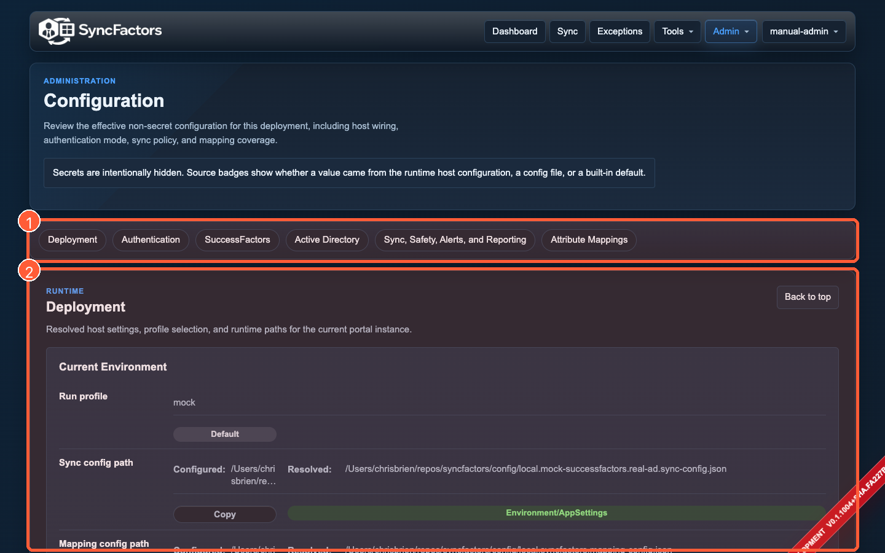

1. Use the section links to jump to deployment, authentication, SuccessFactors, Active Directory, operations, safety, alerts, mappings, and other available sections.
2. Review each value and its source badge. Long values can show a **Copy** button. Secret values are intentionally replaced with **Secret hidden** rather than displayed.

Source badges distinguish values supplied by host/runtime configuration, config files, or built-in defaults. This page is a review surface; it does not edit configuration.

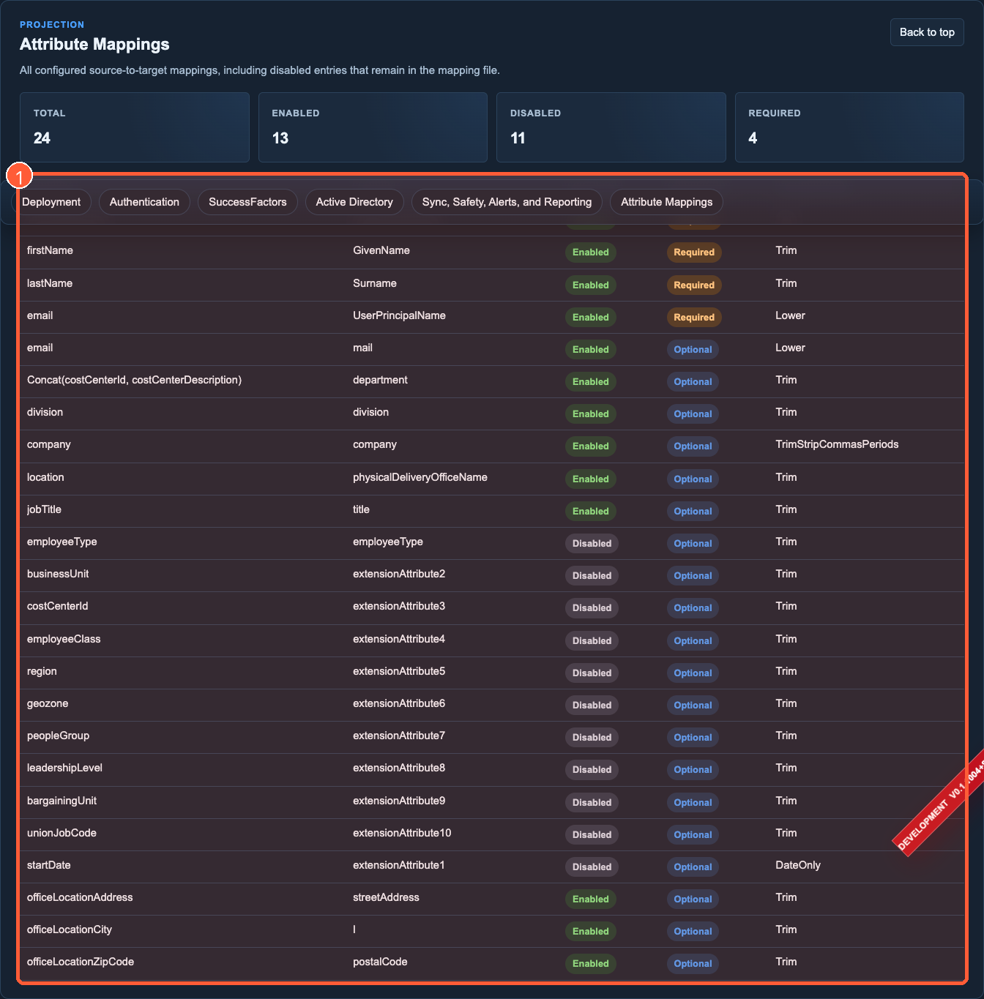

1. Review source path, target attribute, enabled state, required state, and transform for each mapping.

After any deployment or mapping change, use this page to confirm the effective value, then run a dry run and review the resulting diffs.

## 14. Change theme or sign out

Select the signed-in username in the upper-right corner.

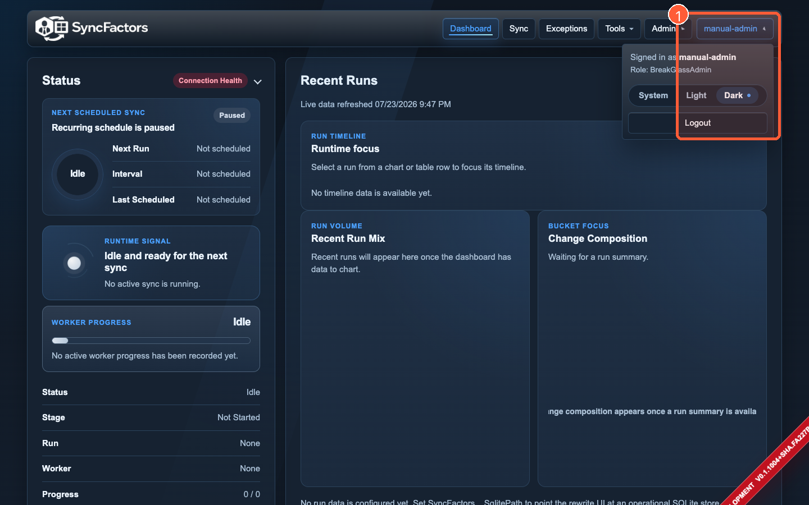

1. Review the signed-in identity and role, select **System**, **Light**, or **Dark**, or select **Logout**.

The selected theme is stored in the browser. Logging out ends the current application session.

## 15. Recommended operating workflow

Use this sequence for routine operation and after configuration changes:

1. **Sign in** with the least-privileged role needed.
2. **Check Dashboard health** for SuccessFactors, Active Directory, Worker Service, and SQLite.
3. **Check the schedule** to avoid overlapping work.
4. **Review Admin Config** when configuration or mapping changed.
5. **Queue a dry run**.
6. **Monitor the run** to a terminal state.
7. **Open Run Detail** and inspect bucket counts, population comparison, and changed attributes.
8. **Triage Exceptions** in failed-run, guardrail, conflict, and manual-review order.
9. **Use Worker 360** for worker-specific investigation.
10. **Use Lookup** only when raw source verification is needed.
11. **Approve live work** only after the reviewed dry-run plan matches expectations.
12. **Verify the resulting live run** and any deletion or apply outcome.
13. **Log out** when administrative work is complete.

## 16. Troubleshooting

| Symptom | Likely meaning | UI-first check |
| --- | --- | --- |
| **Connection Health** is Disabled | Dashboard probes are turned off. | Ask an administrator to review the development probe controls or deployment settings. |
| SuccessFactors or AD is Unhealthy | The portal is reachable, but a dependency check failed. | Open the health menu, then verify effective configuration in Admin Config. |
| A queued run remains Pending | The Worker Service has not claimed the request. | Check Worker Service health and heartbeat. Do not queue duplicates. |
| **Live provisioning** is absent | Live writes are disabled by policy or configuration. | Check the dry-run banner and Admin Config. |
| **Admin** menu is absent | Your role is not Admin/BreakGlassAdmin. | Open the account menu and confirm the displayed role. |
| Worker 360 has no result | Worker ID may not exist, source connectivity failed, or required source data is missing. | Use Lookup with the same identifier and read Worker 360 diagnostics. |
| Lookup returns No Match | SuccessFactors returned no matching OData records. | Confirm whether the value is employee ID or person ID external. |
| Run Detail has no entries | The run may still be queued, may have failed before entry creation, or filters may exclude all entries. | Clear filters and review run status and diagnostics. |
| Apply is unavailable in Worker 360 | Live writes are disabled, your role is insufficient, or the preview is not eligible. | Read the Apply Guardrail message and role display. |
| Apply reports a stale preview | Source or planned state changed after review. | Generate and fully review a new preview; never reuse the old acknowledgement. |
| Deletion action is absent | The record is not yet eligible or your role is insufficient. | Review due date, countdown, hold state, and account role. |

When a run fails, preserve the run ID and use **Run Detail → Export** for a sanitized handoff. Do not copy secrets from deployment files; the UI intentionally omits them.

## 17. Glossary

| Term | Meaning |
| --- | --- |
| **Bucket** | The planner category assigned to a worker, such as create, update, conflict, guardrail failure, manual review, or unchanged. |
| **Dry run** | Plans and records expected changes without writing them to Active Directory. |
| **Live provisioning** | Executes approved synchronization changes against Active Directory. |
| **Fingerprint** | Identifier for the exact saved Worker 360 preview snapshot that was reviewed. |
| **Guardrail failure** | A safety rule blocked or rebucketed a planned operation. |
| **Graveyard** | A configured Active Directory holding area for users pending retention-based deletion. |
| **Hold** | Reversible protection that prevents a graveyard record from proceeding through normal deletion handling. |
| **Manual review** | A worker decision requiring operator investigation rather than automatic apply. |
| **OData lookup** | Direct read-only query against SuccessFactors source data. |
| **Run entry** | Historical worker-level result recorded inside a run. |
| **SAM** | Active Directory `samAccountName`. |
| **Worker 360** | Single-worker source, directory match, planner, diff, history, and guarded apply view. |

---

**Editing note:** This file is the primary manual source. Annotated images are in `images/annotated/`, untouched captures are in `images/raw/`, and `annotate_screenshots.py` regenerates the numbered overlays.
